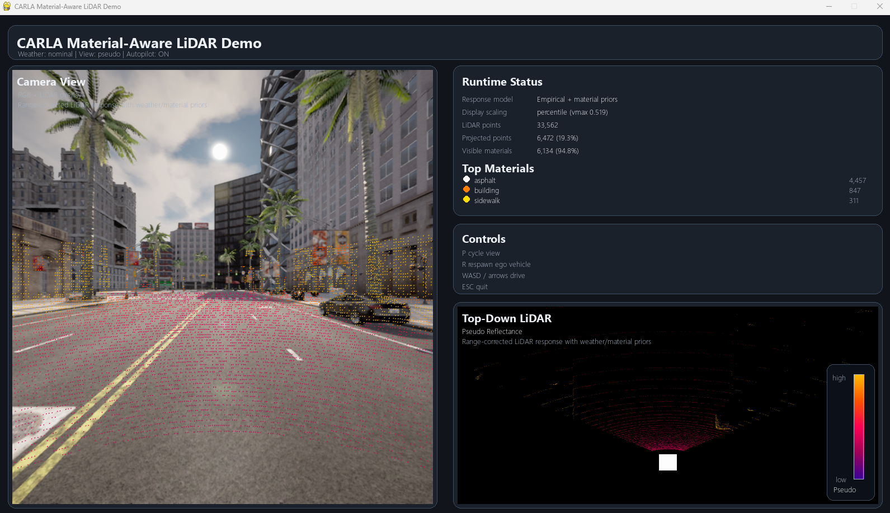
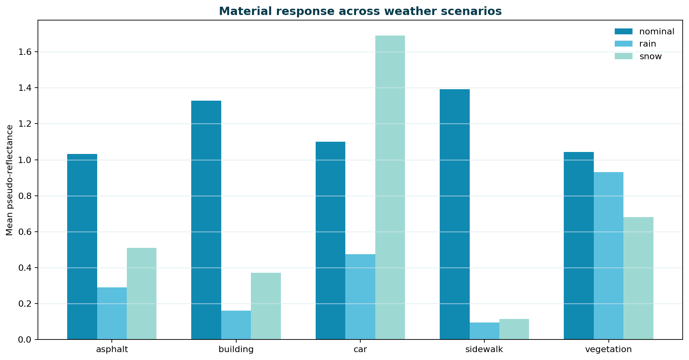
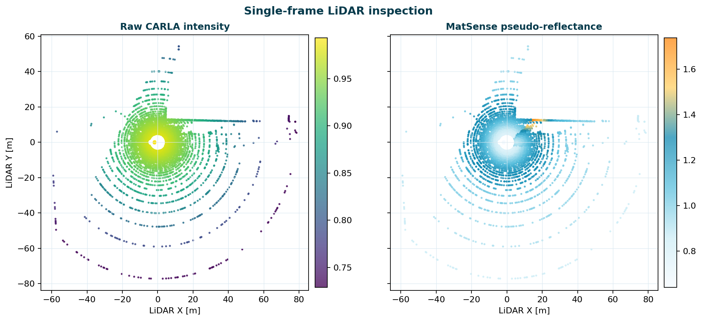
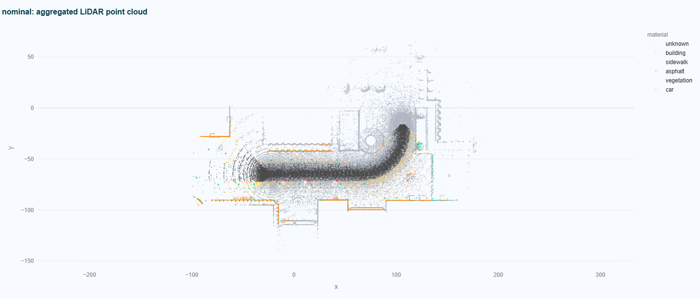

# MatSense: Material- and Weather-Aware LiDAR Inspection in CARLA


MatSense measures how a real LiDAR responds to different materials and transfers
that response into CARLA, so the same scenario can be driven under the
simulator's own sensing, under a scene-uniform degradation, and under the
calibrated material-aware response.

This repository holds **the tool**: the Streamlit dashboard, the CARLA/pygame
runtime viewer, the material-aware LiDAR response, the dataset recorder, and a
small demo dataset so the analyzer works without CARLA.

It deliberately does **not** hold the experiment campaigns, their outputs, the
analysis scripts or the figures. Those are distributed as a replication package,
so a checkout stays small and there is one obvious thing to run.

## What is calibrated, and what is not

The per-material response is estimated from real recordings; the tool reports it
as a measurement-configuration-independent intensity after Laasch et al. (2025),
which is the product of the scanner constant and the reflectance. **It is not a
reflectance**, it depends on the scanner, and a profile calibrated for one
instrument does not transfer to another by rescaling.

Being precise about which numbers are measured matters more than the numbers
themselves:

| | status |
| --- | --- |
| nominal response, per material | measured |
| rain ratio, per material | measured for asphalt, building, car, vegetation |
| rain ratio, sidewalk and fallback | carried over, **not measured** |
| snow ratios | carried over, **not measured** |

The profile files carry the same statement in their own `notes` field. Snow is
offered because the simulator can render it, not because it has been calibrated
against real snow recordings.

## Visual overview




RGB view with projected LiDAR returns, and the top-down material-aware response.



Material response across weather conditions.



Single-frame CARLA intensity against the MatSense response.



Aggregated point cloud over a trajectory.

## Features

**Run Viewer.** Launches the bundled CARLA/pygame viewer, and configures
weather, view mode, trajectory, parked vehicles, autopilot and dataset
recording. Drives a recorded trajectory when one is given, or CARLA autopilot
when none is.

**Profile.** Shows a material profile: per-material coefficients, which ones
are measured and which declared, the factor applied to CARLA's intensity, and
the CARLA-class-to-material mapping.

**Experiment.** Plans and runs closed-loop campaigns with a PCLA agent across
sensing arms, conditions and seeds, then compares the arms on route
completion, collisions, cross-track error and TTC with paired statistics.

**Dataset Analyzer.** Reads a recorded dataset from
`output_dataset/<scene_id>/<scenario>/`, shows the aggregated top-down cloud
over the trajectory, inspects single frames, and compares the material-aware
response against CARLA's own intensity per material class and per condition.

## Repository layout

```
matsense_streamlit_app
|-- .streamlit/config.toml
|-- bundled_toolkit/
|   |-- configs/          calibrated profiles and material overrides
|   |-- scripts/          CARLA runtime: viewer, recorder, response model, campaign runner
|   `-- src/material_aware_toolkit/
|-- docs/
|   |-- assets/
|   |-- USER_GUIDE.md
|   `-- DATASET_FORMAT.md what a recorded run contains and how to read it
|-- sample_data/scene_001/{nominal,rain,snow}
|-- app.py
|-- CITATION.cff
`-- requirements.txt
```

## Installation

```bash
git clone https://github.com/dera8/Matsense.git
cd Matsense
python3 -m venv .venv
source .venv/bin/activate
pip install -r requirements.txt
```

Requirements: Python 3.10+, Streamlit, pandas, NumPy, Plotly, pygame. The Run
Viewer additionally needs CARLA running locally and a Python environment where
`import carla` works. **The Dataset Analyzer needs neither.**

The Browse buttons use `tkinter`. On Ubuntu install it with
`sudo apt install python3-tk` if the file dialog does not open; in a headless
environment, paste paths into the text fields instead.

## Usage

```bash
streamlit run app.py
```

Then open the URL Streamlit prints, usually `http://localhost:8501`.

### Run Viewer

Needs CARLA running with the desired map and the CARLA Python API importable.
Typical settings:

```
Weather          = nominal | rain | snow (snow is not calibrated)
View             = RGB overlays | Material classes | Pseudo-reflectance | CARLA raw intensity
Pseudo scale     = fixed
Material profile = realbag_empirical_v4 by default (the calibrated profile)
Trajectory TXT   = optional recorded UTM trajectory
Trajectory JSON  = optional CARLA-local trajectory
Parked JSON      = optional parked-vehicle layout
Autopilot        = used when no trajectory is given
Save dataset     = records frames, clouds and labels
```

To use a full toolkit checkout instead of the bundled runtime, set the path in
the sidebar or export `MATSENSE_TOOLKIT`.

### Dataset Analyzer

The demo dataset under `sample_data/scene_001` loads by default and contains a
small nominal, rain and snow subset. A recorded dataset has this layout:

```
output_dataset/scene_001/nominal/
  frame_metadata.csv     per-frame pose, weather and coverage
  scenario_metadata.json map, spawn, trajectory and sensor settings
  calibration.json       intrinsics and the camera-from-LiDAR transform
  actors.csv             pose, velocity and box of surrounding actors
  lidar_raw/frame_XXXXXX.npz     xyz and CARLA's own intensity
  lidar_labels/frame_XXXXXX.npz  material, instance id, range, MatSense intensity
```

`lidar_raw/intensity` and `lidar_labels/pseudo_final` are the same returns
before and after the transformation. That pairing is the point of the recording
and the one thing a plain CARLA capture does not give you.
`docs/DATASET_FORMAT.md` documents the rest.

The analyzer reports frames per scenario, route duration and distance, points
per frame, projection and known-material ratios, and the response per material
against CARLA's intensity.

## Not in this repository

The paper's campaign scripts, calibration and analysis scripts, scenario
definitions, agent patches (the PCLA fork with the `perturb_fn` hook) and figure
generators. They are part of the replication package rather than of the tool.
The Experiment page includes its own generic campaign runner.

## Citation

```bibtex
@article{matsense2026,
  title  = {Material-Aware LiDAR Sensing for Simulation-Based Testing of Autonomous Driving Systems},
  author = {Russo, Debora and others},
  year   = {2026},
  doi    = {TBD}
}
```

## License

Not yet chosen. Add a `LICENSE` file before relying on this repository being
reusable: without one, the default is that no permission is granted.
